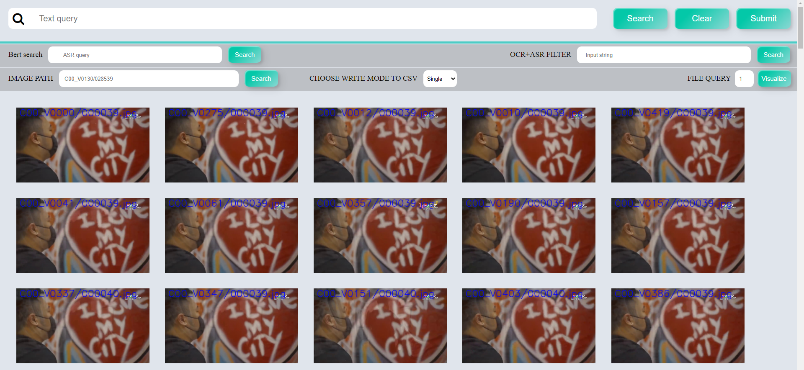

<h1><center>HCM AI CHALLENGE 2022 <br> Event Retrieval from Visual Data</center></h1>

---
## To do task 
- [x] [NLP_Processing](https://github.com/anminhhung/Video-Text-Retrieval/blob/main/utils/nlp_processing.py)
- [x] [Faiss_Processing](https://github.com/anminhhung/Video-Text-Retrieval/blob/main/utils/faiss_processing.py)
- [x] Reranking
- [x] [CLIP](https://github.com/openai/CLIP)
- [x] [TransNet](https://github.com/soCzech/TransNet)
- [x] OCR
- [x] ASR 
- [x] [Faster RCNN](https://tfhub.dev/google/faster_rcnn/openimages_v4/inception_resnet_v2/1)
---
## Setup
```
pip install git+https://github.com/openai/CLIP.git
pip install -r requirements.txt
```
## Download requirement files
- [Cosine_bin_file](https://drive.google.com/file/d/198cixIaMIkOYV5b_bRgmD2udtXXXKFkY/view?usp=share_link)
- [Keyframes_id](https://drive.google.com/file/d/1T4PDAxsbIzXSjlrggliiDaFRnAXE8w3F/view?usp=share_link)
- [dict_id2img_path](https://drive.google.com/file/d/1kVeDkZ2bY5gOqUUcdkDqbkNjm4Uz_hFf/view?usp=share_link)
- [dict_img2id_path](https://drive.google.com/file/d/1ULo9XQYgV1AOki-Khnc-zwlaj5OrGA5S/view?usp=share_link)
- [keyframe_path2id](https://drive.google.com/file/d/1aYz1OcTkcg4kwDB-igRuf5wJLG0UnZuK/view?usp=share_link)
- [info_ocr](https://drive.google.com/file/d/1oNrDHuYeHL4N0nwmx3JG9TLvsCqRbqH1/view?usp=share_link)
- [info_asr](https://drive.google.com/file/d/1DJODlduvLSVSSrWRLhSYvPsc5c6Vm6eM/view?usp=share_link)

## Download requirement files for SBRET
- [faiss_bert_bin](https://drive.google.com/file/d/1NbGnNHFgV_nWK-rjUNvvEneebqZ3JqMw/view?usp=share_link).
- [keyframes_id_bert](https://drive.google.com/file/d/1DpecPqSgk5R6sfy_EjuP0IWwbvG2wbeb/view?usp=share_link).

## Format Keyframes_id.json
Chứa thông tin của tất cả keyframe trong database
```
{"0": {
    "image_path": "Database/KeyFramesC00_V00/C00_V0000/000000.jpg",
    "list_shot_id": ["000000","000039","000079","000096","000118","000158"],

    "list_shot_path": [
      {"shot_id": "000000", "shot_path": "Database/KeyFramesC00_V00/C00_V0000/000000.jpg"},
      {"shot_id": "000039", "shot_path": "Database/KeyFramesC00_V00/C00_V0000/000039.jpg"},
      {"shot_id": "000079", "shot_path": "Database/KeyFramesC00_V00/C00_V0000/000079.jpg"},
      {"shot_id": "000096", "shot_path": "Database/KeyFramesC00_V00/C00_V0000/000096.jpg"},
      {"shot_id": "000118", "shot_path": "Database/KeyFramesC00_V00/C00_V0000/000118.jpg"},
      {"shot_id": "000158", "shot_path": "Database/KeyFramesC00_V00/C00_V0000/000158.jpg"}
    ]
  }
}
```

## Format dict_support_model.json
```
{"0": {
    "image_path": 'Database/KeyFramesC00_V00/C00_V0000/000096.jpg',
    "list_shot_id": ['000000','000039','000079','000096','000118','000158']
  }
}
```

## Format dict_img2id_path.json
Thông tin chi tiết của từng frame trong mỗi video, frame và số thứ tự của frame trong video
```
{
"C00_V00": {
        "C00_V0000": {
                "00000.jpg": 0, # image path của ảnh 1
                "00001.jpg" 1, # image path của ảnh 2 
                ......,
                "n.jph": n, # image path của ảnh n
                "total_image": # tổng số lượng ảnh của C00_V0000
            }
        ....
    }
....
}
```

## Format dict_id2img_path.json
Thông tin chi tiết của từng frame trong mỗi video, frame và số thứ tự của frame trong video

```
{
"C00_V00": {
        "C00_V0000": {
                0: "00000.jpg", # image path của ảnh 1
                1: "00001.jpg", # image path của ảnh 2 
                ......,
                n: "n.jph", # image path của ảnh n
                "total_image": # tổng số lượng ảnh của C00_V0000
            }
        ....
    }
....
}
```

## Hướng dẫn cách sử dụng web
```
python3 app.py
```

Sau khi chạy dòng lệnh trên thì trên URL gõ đường link sau: 

Linux: http://0.0.0.0:5001/thumbnailimg?index=0 

Window: http://127.0.0.1:5001/thumbnailimg?index=0

Lúc này trang web sẽ được hiển thị lên màn hình như sau:


Ở mỗi tấm ảnh có 2 nút **knn** ở bên trái và **select** ở bên phải. Khi chúng ta ấn vào nút **knn** thì sẽ thực hiện chức năng truy vấn ảnh (tìm kiếm ảnh tương đương trong database). Lúc này sẽ xuất hiện thêm 1 tab khác show ra kết quả của truy vấn ảnh.

 

Nút **sellect** sẽ là lựa chọn ảnh đó cùng với shot ảnh của nó để ghi vào file submit 

Ở phần phía trên, nút **Search** dùng để truy vấn text, khi ta nhập câu text query và ấn nút search thì màn hình sẽ trả ra kết quả của những hình ảnh tương đương theo câu truy vấn.

Sau khi chúng ta đã xác định xong việc lựa chọn kết quả thì bấm nút **Download** để thực hiện tải file submit về để submit kết quả lên hệ thống.

Cuối cùng là nhấn nút **Clear** để reset lại file submit dưới hệ thống và tiếp tục thực hiện cho những kết quả tiếp theo.
